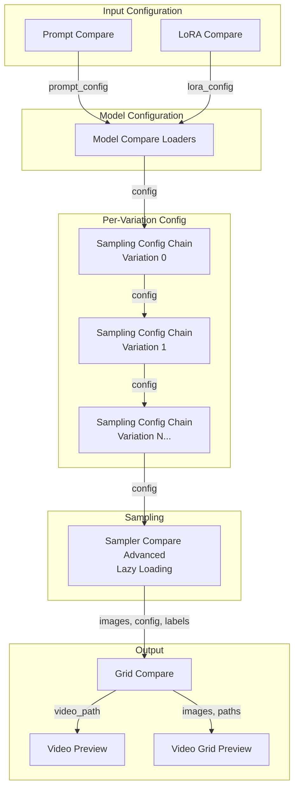
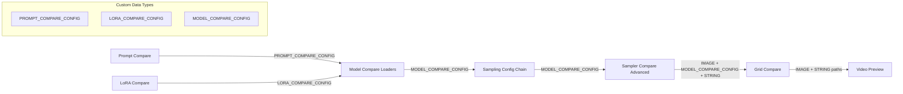
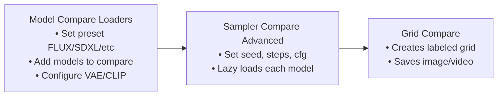
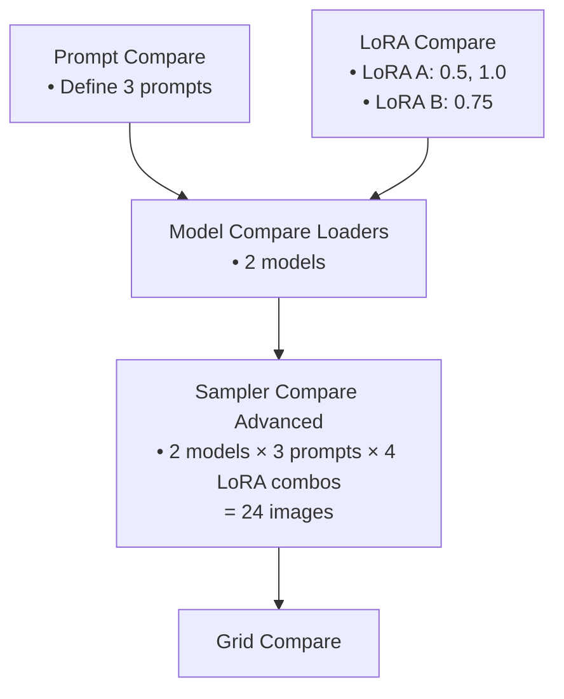

# ComfyUI Model Compare

A comprehensive custom node package for ComfyUI that enables side-by-side comparison of different models, VAEs, CLIPs, LoRAs, and prompts. Features lazy model loading for efficient VRAM usage and visual comparison grid generation.

## Features

- 🔄 **Multi-Model Comparison**: Compare FLUX, FLUX2, SDXL, WAN 2.1/2.2, Hunyuan 1.0/1.5, QWEN, Lumina2 models side-by-side
- ⚡ **Lazy Loading**: Models load on-demand per combination, minimizing VRAM usage
- 📊 **LoRA Testing**: Test multiple LoRAs at different strength values with AND/OR logic
- 🎨 **VAE/CLIP Variations**: Compare different VAE and CLIP configurations  
- 📝 **Prompt Comparison**: Test multiple prompts across models
- ⚙️ **Per-Variation Config**: Fine-tune sampling parameters per model variation
- 🖼️ **Visual Grid Output**: Customizable comparison grids with labels
- 🎥 **Video Support**: Generate video grids for video models (WAN, Hunyuan)
- 📈 **Histogram Analysis**: Analyze and compare image histograms

## Installation

### ComfyUI Manager (Recommended)
1. Open ComfyUI Manager
2. Search for "Model Compare"
3. Click Install

### Manual Installation
```bash
cd ComfyUI/custom_nodes/
git clone https://github.com/tlennon-ie/comfyui-model-compare.git
pip install -r comfyui-model-compare/requirements.txt
```

## Node Overview

All nodes are located under the **Model Compare** menu category.

| Node | Category | Purpose |
|------|----------|---------|
| **Model Compare Loaders** | Model Compare/Loaders | Configure models, VAEs, CLIPs and generate combinations |
| **LoRA Compare** | Model Compare/Loaders | Configure LoRAs with strength variations and AND/OR logic |
| **Prompt Compare** | Model Compare | Define multiple prompt variations |
| **Sampling Config Chain** | Model Compare | Per-variation sampling parameters |
| **Sampler Compare Advanced** | Model Compare/Sampling | Sample all combinations with lazy loading |
| **Grid Compare** | Model Compare/Grid | Create visual comparison grids (image/video) |
| **Video Preview** | Model Compare/Video | Preview generated videos |
| **Video Grid Preview** | Model Compare/Video | Preview image/video grids |
| **Histogram Analyzer** | Model Compare/Analysis | Analyze image histogram |
| **Histogram Comparator** | Model Compare/Analysis | Compare two image histograms |

## Workflow Architecture

The Model Compare system uses a configuration-passing architecture where nodes build up a config object that describes all combinations to test.



## Data Flow Diagram



## Basic Workflow

### Simple Model Comparison



### With Prompts and LoRAs



## Node Details

### Model Compare Loaders

The central configuration node that defines what to compare.

**Key Inputs:**
- `preset`: Model architecture (FLUX, FLUX2, SDXL, WAN2.1, WAN2.2, HUNYUAN_VIDEO, HUNYUAN_VIDEO_15, QWEN, QWEN_EDIT, FLUX_KONTEXT, Z_IMAGE)
- `diffusion_model`: Base model to load
- `num_diffusion_models`: Number of model variations (1-5)
- `num_vae_variations`: Number of VAE variations
- `num_clip_variations`: Number of CLIP variations
- `clip_type`: CLIP architecture (default, flux, flux2, qwen, wan, hunyuan_video, etc.)
- `prompt_config`: Connect from Prompt Compare
- `lora_variation_N`: Connect LoRA configs per model variation

**Output:**
- `config`: MODEL_COMPARE_CONFIG containing all combinations

### LoRA Compare

Configure LoRAs with multiple strength values for comparison.

**Features:**
- Multiple LoRAs per configuration
- Comma-separated strengths: `0.5, 0.75, 1.0` creates 3 variations
- Combinators: `+` (AND) combines LoRAs, ` ` (space/OR) creates separate rows
- HIGH_LOW_PAIR mode for WAN 2.2 style two-phase sampling
- Chainable: Connect multiple LoRA Compare nodes

**Output:**
- `lora_config`: LORA_COMPARE_CONFIG

### Sampling Config Chain

Fine-tune sampling parameters per model variation. Chain multiple nodes for different variations.

**Key Parameters:**
- `variation_index`: Which model variation this config applies to (0, 1, 2...)
- `config_type`: Matches model type for specialized parameters
- Standard: seed, steps, cfg, sampler, scheduler, denoise
- Dimensions: width, height, num_frames (for video)
- Model-specific: qwen_shift, wan_shift, hunyuan_shift, flux_guidance
- Video I2V: reference_image_1/2/3, start_frame, end_frame

### Sampler Compare Advanced

The main sampling node with lazy loading for efficient VRAM usage.

**Features:**
- **Lazy Loading**: Only loads the model needed for each combination
- **Smart Unloading**: Unloads models when config changes
- **Per-Combination Cache**: Reuses results when only some parameters change
- **Internal Latent Generation**: Creates latents based on config chain dimensions
- **Global Overrides**: Set width/height/frames for all variations

**Outputs:**
- `images`: Batch of all generated images
- `config`: Pass-through for grid node
- `labels`: String labels for each image

### Grid Compare

Creates visual comparison grids with labels.

**Features:**
- Auto-detects grid dimensions from LoRA combinators
- Configurable cell size, padding, font
- Prompt text display with wrapping
- Video output for video models (MP4/GIF)
- Individual image saving option

**Outputs:**
- `images`: Grid image tensor
- `save_path`: Path to saved image
- `video_path`: Path to video (if applicable)

## Supported Models

| Preset | Model Type | Notes |
|--------|-----------|-------|
| FLUX | FLUX Dev/Schnell | 16 channel latent |
| FLUX2 | FLUX.2 | 128 channel latent |
| FLUX_KONTEXT | FLUX Kontext | Reference image support |
| SDXL | SDXL 1.0 | Standard SDXL |
| PONY | Pony Diffusion | SDXL-based |
| WAN2.1 | WAN 2.1 | Video model, shift=8.0 |
| WAN2.2 | WAN 2.2 | Two-phase sampling, shift=5.0 |
| HUNYUAN_VIDEO | Hunyuan Video 1.0 | Video model |
| HUNYUAN_VIDEO_15 | Hunyuan Video 1.5 | Video model |
| QWEN | QWEN | AuraFlow sampling, shift=1.15 |
| QWEN_EDIT | QWEN Edit | Image editing with references |
| Z_IMAGE | Lumina2 | AuraFlow sampling |

## Examples

### Basic FLUX Comparison

1. Add **Model Compare Loaders**
   - Set preset: `FLUX`
   - Select base model
   - Set `num_diffusion_models: 2`
   - Add variation model

2. Add **Sampler Compare Advanced**
   - Connect config
   - Set seed, steps, cfg

3. Add **Grid Compare**
   - Connect images, config, labels
   - Configure grid style

### LoRA Strength Comparison

1. Add **LoRA Compare**
   - Select LoRA
   - Set strengths: `0.0, 0.5, 1.0, 1.5`

2. Add **Model Compare Loaders**
   - Connect lora_config to `lora_variation_0`

3. Continue with Sampler and Grid...

### Cross-Architecture Comparison (FLUX vs QWEN)

1. Add **Model Compare Loaders**
   - Set `num_diffusion_models: 2`
   - Model 1: FLUX model
   - Model 2: QWEN model

2. Add **Sampling Config Chain** (Variation 0)
   - `variation_index: 0`
   - `config_type: FLUX`

3. Add **Sampling Config Chain** (Variation 1)
   - `variation_index: 1`
   - `config_type: QWEN`
   - Adjust qwen_shift if needed

4. Continue with Sampler and Grid...

## Troubleshooting

| Issue | Solution |
|-------|----------|
| No images generated | Check model paths exist and preset matches model type |
| Wrong combination count | Verify num_models, num_vaes, num_clips settings |
| VRAM issues | Lazy loading should help - try fewer combinations |
| Cache not invalidating | Change model label or any sampling parameter |
| Video not generating | Ensure num_frames > 1 and video model selected |

## Requirements

- ComfyUI (latest recommended)
- Python 3.10+
- Pillow
- NumPy
- (Video) imageio, imageio-ffmpeg

## License

MIT License - see LICENSE file.

## Changelog

### v4.0.0 (Current)
- **Lazy Loading**: Models load on-demand per combination
- **Sampling Config Chain**: Per-variation parameter control
- **Internal Latent Generation**: No external latent node needed
- **QWEN Edit / FLUX Kontext**: Image editing with references
- **Z_IMAGE (Lumina2)**: New model support
- **Improved Caching**: Per-combination result caching
- **Unified Menu**: All nodes under "Model Compare" category
- **Connection Suggestions**: Auto-suggest Model Compare nodes when connecting

### v3.1.0
- Added Prompt Compare node
- Custom model labels
- Separate prompt grid saving

### v3.0.0
- FLUX/FLUX2 support
- Grouped comparison mode
- Complete sampler rewrite
