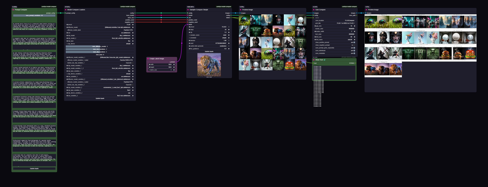
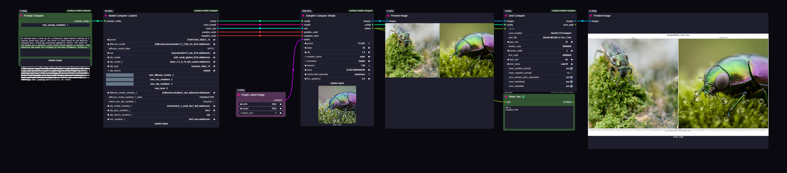

# ComfyUI Model Compare

A custom node package for ComfyUI that enables side-by-side comparison of different models, VAEs, CLIPs, LoRAs, and prompts. Generate visual comparison grids to evaluate model performance.

## Features

- 🔄 **Multi-Model Comparison**: Compare FLUX, FLUX2, SDXL, WAN, Hunyuan, QWEN models side-by-side
- 📊 **LoRA Testing**: Test multiple LoRAs at different strength values
- 🎨 **VAE/CLIP Variations**: Compare different VAE and CLIP configurations
- 📝 **Prompt Comparison**: Test multiple prompts across models
- 🖼️ **Visual Grid Output**: Customizable comparison grids with labels
- 💾 **Flexible Saving**: Save grids, individual images, and metadata

## Installation

### ComfyUI Manager (Recommended)
1. Open ComfyUI Manager
2. Search for "Model Compare"
3. Click Install

### Manual Installation
```bash
cd ComfyUI/custom_nodes/
git clone https://github.com/tlennon-ie/comfyui-model-compare.git
pip install -r comfyui-model-compare/requirements.txt
```

## Nodes Overview

| Node | Purpose |
|------|---------|
| **Prompt Compare** | Define multiple prompts to test |
| **Model Compare Loaders** | Load models, VAEs, CLIPs, LoRAs and generate combinations |
| **Sampler Compare Simple** | Sample all combinations with consistent settings |
| **Grid Compare** | Create visual comparison grids |

## How It Works

### vs Standard ComfyUI Workflow

**Standard ComfyUI:**
```
Load Checkpoint → CLIP Text Encode → KSampler → VAE Decode → Save Image
```

**Model Compare:**
```
Prompt Compare ──┐
                 ├──→ Model Compare Loaders → Sampler Compare → Grid Compare
                 │    (loads all models,      (samples each     (creates
                 │     VAEs, CLIPs, LoRAs)     combination)      comparison grid)
```

The key difference: Model Compare Loaders handles **all** model loading and generates a config containing every combination to test. The Sampler then processes each combination with the same seed for fair comparison.

### Node Connections

```
┌─────────────────┐
│ Prompt Compare  │
│                 ├─── prompt_config ───┐
└─────────────────┘                     │
                                        ▼
┌─────────────────────────────────────────────────────┐
│              Model Compare Loaders                   │
│                                                      │
│  Outputs:                                            │
│  ├── config ─────────────────────────────┬──────────┼───┐
│  ├── base_model ─────────────────────────┼──┐       │   │
│  ├── base_vae ───────────────────────────┼──┼──┐    │   │
│  ├── positive_cond ──────────────────────┼──┼──┼──┐ │   │
│  └── negative_cond ──────────────────────┼──┼──┼──┼─┘   │
└──────────────────────────────────────────┼──┼──┼──┼─────┘
                                           │  │  │  │
                                           ▼  ▼  ▼  ▼
┌─────────────────────────────────────────────────────┐
│            Sampler Compare Simple                    │
│                                                      │
│  Inputs: config, model, vae, positive_cond,          │
│          negative_cond, latent, [sampling params]    │
│                                                      │
│  Outputs:                                            │
│  ├── images ────────────────────────────────────────┼──┐
│  ├── config ────────────────────────────────────────┼──┼──┐
│  └── labels ────────────────────────────────────────┼──┼──┼──┐
└─────────────────────────────────────────────────────┘  │  │  │
                                                         │  │  │
                                                         ▼  ▼  ▼
┌─────────────────────────────────────────────────────┐
│                 Grid Compare                         │
│                                                      │
│  Inputs: images, config, labels,                     │
│          [grid styling options]                      │
│                                                      │
│  Outputs: images, save_path                          │
└─────────────────────────────────────────────────────┘
```

## Example Workflows

### FLUX 1 vs FLUX 2
Compare FLUX Dev 1 against FLUX Dev 2 with their respective VAEs and CLIPs.



📥 [Download Workflow JSON](examples/flux/flux-compare-workflow.json)

### Hunyuan vs FLUX 2 (Cross-Model)
Compare different model architectures side-by-side.



📥 [Download Workflow JSON](examples/multi/Hunyuan-V-Flux2.json)

### SDXL Model Comparison  
*[Coming soon - add workflow.json and workflow.png to examples/sdxl/]*

### WAN 2.1/2.2 Comparison
*[Coming soon - add workflow.json and workflow.png to examples/wan/]*

### Hunyuan Video
*[Coming soon - add workflow.json and workflow.png to examples/hunyuan/]*

## Key Features

### Custom Model Labels
Add custom labels for each model variation to make grids more readable:
- `diffusion_model_label`: Label for base model
- `diffusion_model_variation_1_label`: Label for variation 1, etc.

### Grouped Mode
When comparing models with their paired VAE/CLIP (e.g., FLUX1 with FLUX1-VAE vs FLUX2 with FLUX2-VAE), the system automatically uses grouped mode for cleaner side-by-side comparison.

### Separate Prompt Grids
When testing many prompts, enable "Save prompt grids separately" to create one grid file per prompt instead of one massive grid.

### LoRA Strength Testing
Test LoRAs at multiple strengths in a single run:
```
0.0, 0.5, 1.0, 1.5  # Creates 4 variations
```

## Troubleshooting

| Issue | Solution |
|-------|----------|
| No images generated | Check model paths exist and latent dimensions match |
| Wrong combination count | Verify num_models, num_vaes, num_clips settings |
| CLIP warning appears | Normal for FLUX - CLIP loads correctly despite warning |
| Prompt text cut off | Increase grid size or reduce font size |

## Requirements

- ComfyUI (latest recommended)
- Python 3.8+
- Pillow (included with ComfyUI)

## License

MIT License - see LICENSE file.

## Changelog

### v3.1.0 (Current)
- Added Prompt Compare node
- Custom model labels
- Separate prompt grid saving
- Improved prompt text wrapping
- Production cleanup

### v3.0.0
- FLUX/FLUX2 support with proper CLIP handling
- Grouped comparison mode
- Complete sampler rewrite
